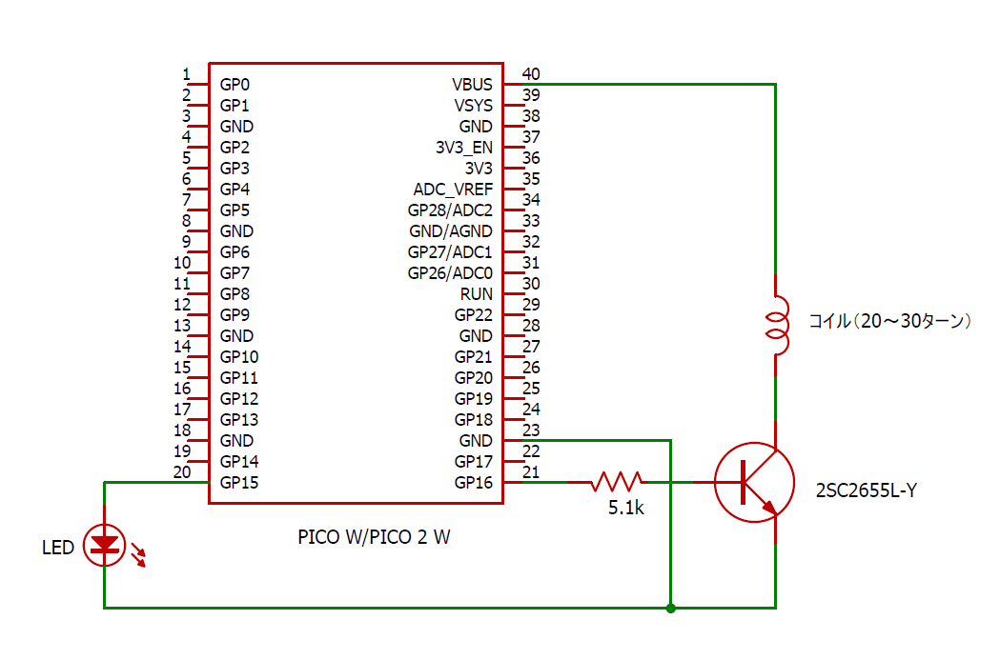

# 疑似JJY送信機

JJYの電波は、PCやディスプレイなどが発するノイズにより受信できなことがあります。しかし、PCがないと、JJYを使うアプリケーションの開発ができませんよね。疑似JJY送信機は、そのような場合に利用する開発支援ツールです。本物のJJYに代わって、JJY信号を送信します。

なお、送信と言っても電波はほとんど出ておらず、もっぱらコイルとJJY受信ユニットのバーアンテナとの磁気結合に期待する送信機です。疑似JJYの受信可能範囲はせいぜい半径30センチ以内でしょう。開発ターゲットの至近に置いて利用してください。ただし、至近すぎると信号が飽和するので、JJY信号のパルス幅を見ながら適切な距離に調整する必要があります。

## Schematic



疑似JJY送信機は、NTPで時刻合わせを行って正確な時刻のJJY信号を送信します。したがって、Pico WかPico 2 Wを利用してください。Pico/Pico 2には対応しません。

コイルは被覆銅単線をサインペンなどに20～30ターンほど巻いたものを使います。


## WIFI_CONFIG.py

pseudo_jjy.pyと同時に下のような`WIFI_CONFIG.py`を作成し、Pico W/Pico 2 Wにアップロードして利用してください。

```python
WIFI_CONFIG = {
    "ssid": "your_access_point",    # アクセスポイントのSSID
    "pass": "your_passphrase"       # 接続パス
}
```
