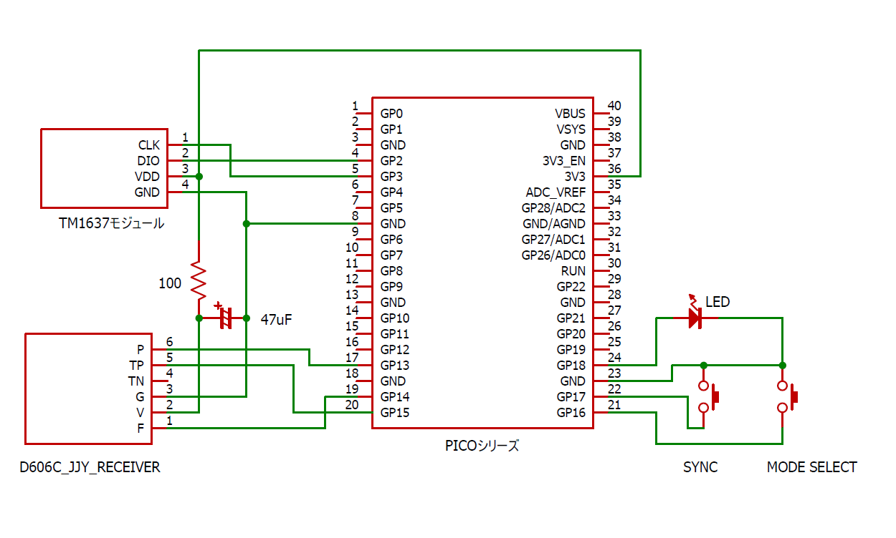

# 電波時計サンプル

Picoシリーズ（Wi-FiがないPico/Pico 2）とMicroPythonを使った電波時計のサンプル。JJY受信ユニットは、[aitendoで販売されているD606C](https://www.aitendo.com/product/9148)で動作確認を行っていますが、出力極性、電源制御（P、PONなど）、バンド切り替え（F、SELなど）のカスタマイズが可能なので、市販されている、ほとんどのJJY受信ユニットに適合するはずです。

## 特徴

* 要所にPIOを使用
* 非同期設計によるリアルタイム処理
* MicroPythonとして可能な限りの高い精度（ベストケースで±10ms程度）

## Schematic



表示にはTM1637を使用した4桁の7セグメントLEDモジュールを使用しています。TM1637を使ったモジュールなら、たいてい利用できると思います。

GP18のLEDは、JJYと時刻同期に成功していれば点灯するインジケータ。GP16のタクトスイッチは、表示モード切替、GP17のタクトスイッチは強制同期スイッチです。

| GPIO番号 | 接続するデバイスの端子             |
| -------- | ---------------------------------- |
| GP2      | TM1637モジュールDIO（SDA）         |
| GP3      | TM1637モジュールCLK                |
| GP13     | JJY受信ユニットP、ON               |
| GP14     | JJY受信ユニットバンド切り替えF/SEL |
| GP15     | JJY受信ユニット出力TP/OUTP/OUT     |
| GP16     | タクトスイッチ1                    |
| GP17     | タクトスイッチ2                    |
| GP18     | LEDのアノード                      |


## ソースコード構成

* boot.py：起動時にSMPSをPWMに切り替えるbootファイル
* Debug.py：デバッグメッセージクラス
* JJYDecoder.py：JJYデコーダー
* JJYReceiver.py：JJY受信ユニット制御クラス
* JJY_CONFIG.py：設定ファイル
* RTCClockApp.py：時計アプリケーションクラス
* TimeSource.py：基底クラスTimeSource
* TimeSyncer.py：基底クラスTimeSyncer
* tm1637.py：TM1637ディスプレイライブラリ
* WaveClock.py：メインプログラム

## 設定ファイル

設定ファイル**JJY_CONFIG.py**を環境に合わせて編集してください。

```python
JJY_CONFIG={
    "signal_out_pin": 15,       # 信号入力GPIO
    "signal_pol": 1,            # 信号の極性
    "pon_pin": 13,              # 電源制御（PON）GPIO
    "pon_pol": 0,               # PON極性（0でオン）
    "band_select_pin": 14,      # バンド切り替えGPIO
    "default_band": 1,          # 優先するバンド（1か0）
    "tm1637_sda_pin": 2,        # TM1637 SDAピン
    "mode_select_pin": 16,      # モード選択スイッチ
    "force_sync_pin": 17,       # 強制受信スイッチ
    "sync_indicator_pin":18,    # 同期インジケーターLED
}
```

JJY_CONFIGは、Pythonの辞書型です。`pon_pol`にJJY受信ユニットの電源制御端子の極性（オンになる値）を、`default_band`にお住まいの地域で受信できるJJYのバンドの値を、`signal_pol`に出力の極性（正論理なら1、負論理なら0）を設定します。LEDやスイッチ、TM1637などを接続したGPIOが異なる場合は、それぞれを設定してください。

## 実行

すべてのソースコードをPicoシリーズにアップロード後、メインプログラム `WaveClock.py`を実行します。ディスプレイの初期表示は `----`ですが、JJYとの同期に成功すると時刻が表示されます。JJYとの同期は、強制同期ボタンを押さない限り1時間に1回行われます。

JJY同期中は、受信している信号に合わせてオンボードLEDが点滅します。1秒に1回の点滅があれば、正常にJJYを受信できています。チラチラしていたり、点灯しっぱなしあるいは消灯したままならば、正常にJJYを受信できていないか、接続ミスあるいは極性設定のミスなどが考えられます。
